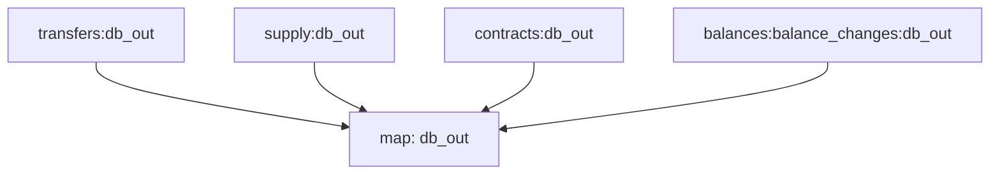

# ERC-20 Substreams

> All Substreams for ERC-20 tokens.

## Quickstart

```
$ gh repo clone pinax-network/erc20-substreams
$ cd erc20-substreams
$ make
$ make gui
```

## Releases

- https://github.com/pinax-network/erc20-substreams/releases

## References

- [Ethereum Docs: ERC-20 Token Standard](https://ethereum.org/en/developers/docs/standards/tokens/erc-20/)
- [EIPS: ERC-20 Token Standard ](https://eips.ethereum.org/EIPS/eip-20)
- [OpenZeppelin implementation](https://github.com/OpenZeppelin/openzeppelin-contracts/blob/9b3710465583284b8c4c5d2245749246bb2e0094/contracts/token/ERC20/ERC20.sol)
- [ConsenSys implementation](https://github.com/ConsenSys/Tokens/blob/fdf687c69d998266a95f15216b1955a4965a0a6d/contracts/eip20/EIP20.sol)

### Data extracted

| Event         | Description                                  |
| ------------- | -------------------------------------------- |
| [`Transfers`] | Get Erc20 transfers                          |
| [`supply`]    | Get the total supply for every token         |
| [`contract`]  | Get Token information (Name,symbol,decimals) |
| [`balances`]  | Get all balance changes                      |

### Mermaid Graph



Here is a quick link to see the graph:

https://mermaid.live/edit#pako:eJy8VtuOmzAQ_RXk5wRt2zf61u4ftG8LQg5MLgoY5EuqaLX_Xi1kQ3B8D84b2DPnzIztOfOOqq4GlKEdxf0--fv6MydJUm_KTvC3FvfZ5bsY1jnFhG2BsmxcTdbrXLy8_ICL1WDERN83Z5NF1RFOccWNMBvcYFJBWe0x2YHRdAqrxX15_Rvj12yOCbFtCnwPFESb8nMP6el7-qvpquMb6wStINNbFFMoGgplyeSgbsvLtikTG8Yp4Jalp2_pbzkUxbYyDntxLF6XQxxcuiOQclwYo9dsFree8vF9Gp9wc6hLaWcKRAN7i8p4R-ErluEnU20VphzuCG8972_wLOUlT2sGqUsyWa-TGhqO7-t076iqubQ2y8bBfsln4s4adJGsqSm9rJfWdl2dmWxEghxJ9494p6Xxi5KYhstEpXhFapNFX5WaYumS2FEHWbUW4GoVtQZXlqXL4AQ8djX1y513cg_PxS-5gctENf8vGcfc_HBVDlEPX0UYeFzhXNPgN8KPzeS6-nUPLGaFhBUwalgYJIJPwCnI4Vg1m3JoSnSVpmvwlOOyHMGS7VNGNVXC2ct5LvFyWXI08SIOvX4uORq6nFeMrqnpO53ZzzisBLlGTNI0teg91Y8t5uxiY4lTISdsaY5xMIxdkvnQsXhVXOEdxpog50jPwTbf6D31I46fT-x74TB8BM06AYzOuvdktXPVOE9l89Qzrxvtp13eiuWtUw8Hb9IkkxLF1B-DMjyUrwFH0pXIamJu8g_laIZyUAlvbXgoXJsOuHf_5_X84L7r1N8d0dEKtUBbfKhRht5zxPfQQo6yHNWwxaLhOfpAK4QF7_6cSYUyTgWskOhrzOH1gHcUt-Pix_8AAAD__8TGjRA

### Modules

```yaml

Name: db_out
Initial block: 1
Kind: map
Input: map: transfers:db_out
Input: map: supply:db_out
Input: map: contracts:db_out
Input: map: balance_changes:db_out
Output Type: proto:sf.substreams.sink.database.v1.DatabaseChanges
Hash: 5beeeb620f260e0d64e55f0785ff997a454a66df
```
