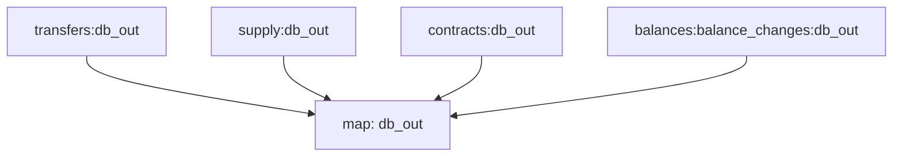

# ERC-20 Substreams

> All Substreams for ERC-20 tokens.

## Quickstart

```
$ gh repo clone pinax-network/erc20-substreams
$ cd erc20-substreams
$ make
$ make gui
```

## Releases

- https://github.com/pinax-network/erc20-substreams/releases

## References

- [Ethereum Docs: ERC-20 Token Standard](https://ethereum.org/en/developers/docs/standards/tokens/erc-20/)
- [EIPS: ERC-20 Token Standard ](https://eips.ethereum.org/EIPS/eip-20)
- [OpenZeppelin implementation](https://github.com/OpenZeppelin/openzeppelin-contracts/blob/9b3710465583284b8c4c5d2245749246bb2e0094/contracts/token/ERC20/ERC20.sol)
- [ConsenSys implementation](https://github.com/ConsenSys/Tokens/blob/fdf687c69d998266a95f15216b1955a4965a0a6d/contracts/eip20/EIP20.sol)

### Data extracted

| Event         | Description                                  |
| ------------- | -------------------------------------------- |
| [`Transfers`] | Get Erc20 transfers                          |
| [`supply`]    | Get the total supply for every token         |
| [`contract`]  | Get Token information (Name,symbol,decimals) |
| [`balances`]  | Get all balance changes                      |

### Mermaid Graph



Here is a quick link to see the graph:

https://mermaid.live/edit#pako:eJy0WM1u2zAMfhVD58botpt32_oG260ODNVmkyC2bOgnW1D03YfaWZyoov4g3WKKHz-SIkW2b6QdOyAV2XE67YvfT99rVhTdSzMq-TzQqbr83s5yySkTr8BFtUiLzaZWj4_f4KI1Kwk1Tf3ZptGOTHLaSquZF9pT1oKoLj-adk_ZDqyY1b-BTs31awkEOVwiE68lyD1wUEMpzxOUp6_lj35sj89iVLyFCtfYrq4gFDbfTOAD6-AvCp9var0fw8E1JKFehORAB1GevpQ_9XgMx8ZgroZDA8GAt_WlS1M77y4PB-pSzzNkPAJrFsHiPXK4vUXqBfyhfKL9oWu0k9URxKzNn0_gpYo-A7X60aVp8q9bDfLciLqtmTtRUofd9-4BMV24JruLw0M_5SvlzxpVxc7QjChnx7h6xZvJRaTYkY1_WHBYCC5LYAiXjcrQP2aVpP1kpkidErdV86OHamXNgfF5S5EGL8NCjhyQzp3P0OxYkMmL3MJlo7r_boSk0t64JkDWyzcRRl5XPNe6gC_ml8fkKv1fBw61rWYrYs9xMPg4W2w2RQe9pEazyxKEGfzwcI16rhPkUI81wpU7e5o57XkyHKQpSoNhW0pCgLfzRZemdt74t6TTcyPKe1cLgqRc14KIY1vSJ0bLyx_ko29o-Otvx1kXuChoxiBtmxyONDdbzn3OxZInQ1620ccz83rnQZQnK77mPVa9KHCmdnDtfDgSX_vCMLnrwmMhi9r_IhjRf6-iAzAEkXL-hfC6Q7NMv3DcNjiVnmHhTWCFWSdfDDJbgLaxhwJvp55DKU0nO0hyJMfHsjbw3HqZs3E_jxInxNO4x6yLwWZpANegQ4H4nAuCZC6H8JnjNeRC-cgDGYAP9NCRirzVRO5hgJpUNenglape1uSdPBCq5PjrzFpSSa7ggaipoxKeDnTH6bAI3_8FAAD__7y-6oI

### Modules

```yaml

Name: db_out
Initial block: 20000000
Kind: map
Input: map: transfers:db_out
Input: map: supply:db_out
Input: map: contracts:db_out
Input: map: balances:balance_changes:db_out
Output Type: proto:sf.substreams.sink.database.v1.DatabaseChanges
Hash: a8aeff108a2dd5c82f0eba307d78fe7ce1b0df94

```
